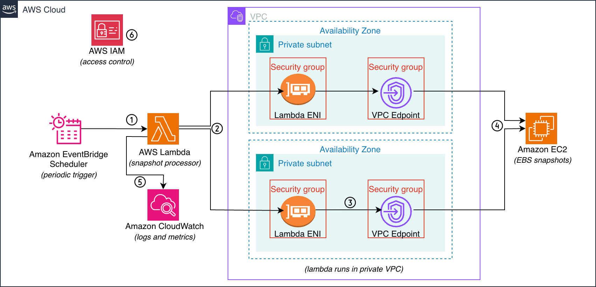

# EC2 SNAPSHOT DELETION USING LAMBDA

## OVERVIEW

This solution automates the deletion of EC2 snapshots using AWS Lambda. The function retrieves available snapshots, evaluates their StartTime, and deletes them based on the configured retention period. EventBridge Scheduler triggers the Lambda function on a defined schedule, while the function runs securely inside a VPC using private subnets to ensure controlled and private network access.

## ARCHITECTURE:

 
1.	EventBridge Scheduler invokes the Lambda function on a rate-based schedule (for example, once per day). 
2.	AWS Lambda runs as a snapshot cleanup processor inside the VPC using private subnets via ENIs. It retrieves EC2 snapshots, evaluates their StartTime, and deletes snapshots older than the configured retention period (for example, older than one year). 
3.	The Lambda ENI security group allows outbound HTTPS traffic only to the VPC endpoint security group, and the VPC endpoint security group allows inbound HTTPS traffic only from the Lambda security group, keeping all traffic private within the VPC. 
4.	The EC2 VPC endpoint securely forwards Lambda’s API calls such as DescribeSnapshots and DeleteSnapshot to the EC2 service without using the public internet. 
5.	CloudWatch handles monitoring by capturing Lambda logs and metrics for execution, performance, and errors.
6.	IAM enforces least-privilege access by granting Lambda only required snapshot, cloudwatch and VPC permissions, and allowing EventBridge Scheduler only to invoke the Lambda function. 

## DEPLOYMENT PROCEDURE:

This section covers how to execute the Infrastructure as Code (IaC) to create the entire infrastructure (VPC, subnets, IAM roles, EventBridge Scheduler), deploy the Lambda function, and configure it to run within private VPC subnets using VPC endpoints.

### Prerequisites:
- Clone the GitHub repository.
- Ensure AWS credentials are configured and accessible to Terraform.
- Ensure required AWS permissions are available for Lambda, IAM, EC2, VPC, and EventBridge Scheduler.

### Step 1: 
Navigate to the production environment directory
- cd aws-ec2-snapshot-cleanup/terraform/environments/prod

### Step 2: 
Update terraform.tfvars with required inputs such as region, VPC and subnet CIDRs (optional, ensure no overlap with existing networks), retention_days (default 365), and schedule_expression (default rate(1 day))

### Step 3: 
Initialize Terraform, this initializes the working directory and downloads required providers and modules.
- terraform init

### Step 4: 
Review the execution plan, this shows the resources that will be created, including VPC and private subnets, Security groups , VPC endpoint , IAM roles and policies, Lambda function and EventBridge Scheduler.
- terraform plan

### Step 5: 
Apply the configuration to create infrastructure, package and deploy the Lambda function, and configure the scheduler.
- terraform apply

### Step 6: 
Verify the deployment in the AWS Console by confirming that the following resources are created successfully: 
- one VPC, two private subnets, a VPC endpoint, security groups for Lambda and the VPC endpoint, the Lambda function with its IAM role and policies, VPC and networking components, and CloudWatch log group, and the EventBridge Scheduler configured with the Lambda function as the target.

### Step 7: 
- Test functionality by ensuring EC2 snapshots exist in the account, preferably at least one day old to validate the deletion functionality.
- For testing, you can adjust parameters in terraform.tfvars  such as setting retention_days to 1 and schedule_expression to rate(30 minutes) and re-deploy. Alternatively, manually invoke the Lambda function and verify that older snapshots are deleted while recent snapshots are skipped. 
- Check CloudWatch logs to confirm execution details, including total snapshots processed, deleted, skipped, and failed, along with clear logging. You can also review CloudWatch metrics to monitor Lambda performance.

### Step 8: 
(Optional) Use the dev environment to deploy only the Lambda function and EventBridge Scheduler without networking resources, while maintaining the same functionality in a more cost-efficient setup

### Step 9: 
Once testing is complete, clean up all provisioned resources in the environment.
- terraform destroy

## DESIGN CONSIDERATIONS

This design is considered and implemented based on the scope of this exercise.

### Chosen IaC (Terraform):
- Terraform is used to define and manage the entire infrastructure in a single declarative workflow. It allows direct packaging and deployment of the Lambda function from a local zip file without requiring additional steps such as S3 uploads or CLI-based packaging, making the process simpler compared to CloudFormation. It also supports a modular structure, improving reusability, maintainability, and scalability of the solution.

### Lambda Code Packaging and Deployment:
- The Lambda function is packaged using a Terraform module that leverages the archive_file data source to automatically zip the Python code. The generated zip file path and hash are passed to the Lambda resource, ensuring the code is deployed and automatically updated during terraform apply without any manual packaging steps.

### Terraform State Management:
- For simplicity in this exercise, no remote backend such as Amazon S3 with DynamoDB locking is configured. The Terraform state is stored locally using the default local state file.

### Chosen Infrastructure Components:
- VPC endpoints are used instead of a NAT Gateway to keep the solution cost-efficient while enabling private communication only between AWS services without exposing traffic to the public internet.
- EventBridge Scheduler is used to trigger the Lambda function on a rate-based schedule.
- The infrastructure is region-agnostic and can be deployed in any AWS region. For high availability, two availability zones are used to ensure resilience.
- CloudWatch Logs are used for execution logging and troubleshooting, with basic error handling in the Lambda function to capture API call failures. CloudWatch Metrics are used to monitor performance, and the Lambda function is configured with appropriate timeout and memory settings.

### Environments (Dev and Prod):
The solution uses two environments (dev and prod):
- In dev, the Lambda function is deployed without VPC configuration to keep the setup simple and cost-efficient.
- In prod, the Lambda function runs inside a VPC using private subnets and a security group, configured. This ensures secure and controlled network access while keeping development lightweight and cost-efficient.

